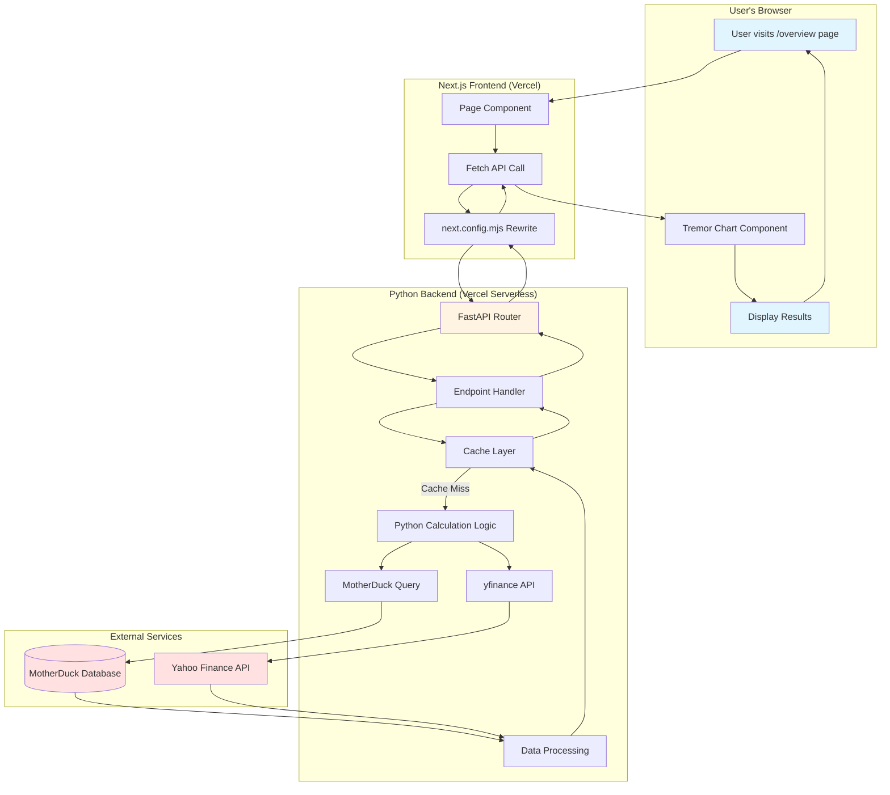

# 🔄 Data Flow & Architecture Guide

**Last Updated:** 2026-02-15  
**For:** JCN Stock Scanner Dashboard

---

## 📊 Visual Data Flow Diagram



---

## 🏗️ Architecture Explained (Simple Terms)

### Think of it like a restaurant:

1. **Frontend (Next.js + Tremor)** = The dining room
   - Beautiful tables and chairs (Tremor components)
   - Menu (your pages)
   - Waiters (API calls)

2. **Backend (FastAPI)** = The kitchen
   - Chefs (Python functions)
   - Recipes (calculation logic)
   - Ingredients (data from MotherDuck)

3. **Database (MotherDuck)** = The pantry
   - Stores all your stock data
   - Fast access to historical prices
   - Organized by SQL queries

---

## 🔄 How Data Flows (Step-by-Step)

### Example: User wants to see portfolio performance

**Step 1: User Action**
```
User clicks on "Overview" page
```

**Step 2: Frontend Request**
```javascript
// In src/app/overview/page.tsx
const response = await fetch('/api/portfolio/performance', {
  method: 'POST',
  body: JSON.stringify({
    symbols: ['AAPL', 'GOOGL'],
    start_date: '2024-01-01',
    end_date: '2026-02-15'
  })
});
```

**Step 3: Next.js Rewrite**
```javascript
// next.config.mjs automatically rewrites:
// /api/portfolio/performance → /api/ (Python function)
```

**Step 4: FastAPI Receives Request**
```python
# In api/index.py
@app.post("/api/portfolio/performance")
async def get_portfolio_performance(request: PortfolioRequest):
    # This function is called!
```

**Step 5: Python Does the Work**
```python
# Inside the function:
1. Check cache (already calculated?)
2. If not cached:
   a. Query MotherDuck for historical data
   b. Fetch current prices from yfinance
   c. Calculate returns, volatility, Sharpe ratio
   d. Store in cache
3. Return JSON response
```

**Step 6: Data Returns to Frontend**
```javascript
// Back in page.tsx
const data = await response.json();
// data = {
//   "AAPL": { return: 25.5%, volatility: 18.2%, ... },
//   "GOOGL": { return: 18.3%, volatility: 22.1%, ... }
// }
```

**Step 7: Tremor Displays Results**
```javascript
<AreaChart
  data={data}
  categories={["AAPL", "GOOGL"]}
  colors={["blue", "green"]}
/>
```

---

## 🧩 Where Does Each Part Live?

### Frontend Files
```
src/app/overview/page.tsx          ← Page component
src/components/PortfolioChart.tsx  ← Reusable chart component
```

### Backend Files
```
api/index.py                       ← All Python code
  ├── FastAPI app setup
  ├── Endpoint definitions
  ├── MotherDuck connection
  ├── Calculation logic
  └── Cache management
```

### Configuration Files
```
next.config.mjs                    ← Routes /api/* to Python
vercel.json                        ← Tells Vercel about Python
requirements.txt                   ← Python dependencies
```

---

## 🔧 How Python Calculations Work

### Example: Portfolio Performance Calculation

**Location:** `api/index.py` (lines 381-430)

```python
@app.post("/api/portfolio/performance")
async def get_portfolio_performance(request: PortfolioRequest):
    """
    This is the main endpoint that:
    1. Receives symbols and date range
    2. Queries MotherDuck for historical prices
    3. Fetches current prices from yfinance
    4. Calculates performance metrics
    5. Returns JSON
    """
    
    # Step 1: Extract request data
    symbols = request.symbols
    start_date = request.start_date
    end_date = request.end_date
    
    # Step 2: Get data from MotherDuck
    md_data = get_motherduck_data(symbol)
    
    # Step 3: Get current prices
    current_prices = await get_current_prices(symbols)
    
    # Step 4: Calculate metrics
    returns = calculate_returns(md_data, current_prices)
    volatility = calculate_volatility(md_data)
    sharpe = calculate_sharpe_ratio(returns, volatility)
    
    # Step 5: Return results
    return {
        "symbol": symbol,
        "return": returns,
        "volatility": volatility,
        "sharpe_ratio": sharpe
    }
```

### Where Calculations Happen

**MotherDuck Queries** (lines 162-200)
```python
def get_motherduck_data(symbol: str):
    """
    Connects to MotherDuck and runs SQL queries
    Returns: Historical price data
    """
    conn = get_motherduck_connection()
    query = f"""
        SELECT date, close_price, volume
        FROM stock_prices
        WHERE symbol = '{symbol}'
        AND date BETWEEN '{start_date}' AND '{end_date}'
        ORDER BY date
    """
    result = conn.execute(query).fetchall()
    return result
```

**Current Price Fetching** (lines 220-260)
```python
async def get_current_prices(symbols: List[str]):
    """
    Uses yfinance to get real-time prices
    Returns: Current prices for all symbols
    """
    prices = {}
    for symbol in symbols:
        ticker = yf.Ticker(symbol)
        prices[symbol] = ticker.info['regularMarketPrice']
    return prices
```

**Performance Calculations** (lines 280-350)
```python
def calculate_returns(historical, current):
    """
    Calculates percentage return
    """
    start_price = historical[0]['close_price']
    end_price = current
    return ((end_price - start_price) / start_price) * 100

def calculate_volatility(historical):
    """
    Calculates standard deviation of returns
    """
    prices = [row['close_price'] for row in historical]
    returns = np.diff(prices) / prices[:-1]
    return np.std(returns) * np.sqrt(252)  # Annualized
```

---

## 🎨 How Tremor Manages Data

### Tremor is Just React Components

**Example: Area Chart**

```javascript
// In your page component
import { AreaChart } from '@tremor/react';

export default function OverviewPage() {
  const [data, setData] = useState([]);
  
  useEffect(() => {
    // Fetch data from Python API
    fetch('/api/portfolio/performance', {
      method: 'POST',
      body: JSON.stringify({ symbols: ['AAPL', 'GOOGL'] })
    })
    .then(res => res.json())
    .then(data => setData(data));
  }, []);
  
  return (
    <AreaChart
      data={data}
      index="date"
      categories={["AAPL", "GOOGL"]}
      colors={["blue", "green"]}
    />
  );
}
```

**Key Points:**
- Tremor doesn't manage data - React does
- You fetch data from Python API
- Store it in React state
- Pass it to Tremor components
- Tremor renders beautiful charts

---

## ➕ How to Add New Modules (Safe Method)

### Method 1: Add New API Endpoint

**Step 1: Add endpoint to `api/index.py`**
```python
@app.get("/api/stock-screener")
async def screen_stocks(
    min_pe: float = 0,
    max_pe: float = 100,
    min_volume: int = 1000000
):
    """Screen stocks by criteria"""
    conn = get_motherduck_connection()
    query = f"""
        SELECT symbol, pe_ratio, volume
        FROM stocks
        WHERE pe_ratio BETWEEN {min_pe} AND {max_pe}
        AND volume >= {min_volume}
    """
    results = conn.execute(query).fetchall()
    return {"stocks": results}
```

**Step 2: Test it**
```bash
curl https://jcn-tremor.vercel.app/api/stock-screener?min_pe=10&max_pe=20
```

**Step 3: Use it in frontend**
```javascript
const response = await fetch('/api/stock-screener?min_pe=10&max_pe=20');
const data = await response.json();
```

### Method 2: Add New Page

**Step 1: Create page file**
```bash
src/app/screener/page.tsx
```

**Step 2: Add page component**
```javascript
'use client';
import { useState } from 'react';
import { Table } from '@tremor/react';

export default function ScreenerPage() {
  const [stocks, setStocks] = useState([]);
  
  const handleScreen = async () => {
    const res = await fetch('/api/stock-screener?min_pe=10&max_pe=20');
    const data = await res.json();
    setStocks(data.stocks);
  };
  
  return (
    <div>
      <h1>Stock Screener</h1>
      <button onClick={handleScreen}>Screen Stocks</button>
      <Table data={stocks} />
    </div>
  );
}
```

**Step 3: Access it**
```
https://jcn-tremor.vercel.app/screener
```

### Method 3: Add New Chart Component

**Step 1: Create component file**
```bash
src/components/StockComparisonChart.tsx
```

**Step 2: Add component**
```javascript
import { BarChart } from '@tremor/react';

export function StockComparisonChart({ data }) {
  return (
    <BarChart
      data={data}
      index="symbol"
      categories={["return", "volatility"]}
      colors={["blue", "red"]}
    />
  );
}
```

**Step 3: Use it in any page**
```javascript
import { StockComparisonChart } from '@/components/StockComparisonChart';

<StockComparisonChart data={portfolioData} />
```

---

## 🛡️ How to Avoid Breaking Things

### Rule 1: Never Touch These Files
```
next.config.mjs    ← API routing (already configured)
vercel.json        ← Deployment config (already configured)
```

### Rule 2: Always Test Locally First
```bash
# Terminal 1: Run Python API
cd api
uvicorn index:app --reload --port 8000

# Terminal 2: Run Next.js
pnpm dev

# Test endpoint
curl http://localhost:3000/api/your-new-endpoint
```

### Rule 3: Follow the Pattern

**For new API endpoints:**
```python
@app.get("/api/your-endpoint")  # ← Must start with /api/
async def your_function():      # ← Use async
    try:
        # Your logic here
        return {"data": result}
    except Exception as e:
        logger.error(f"Error: {e}")
        raise HTTPException(status_code=500, detail=str(e))
```

**For new pages:**
```javascript
'use client';  // ← Always add this at top
import { useState, useEffect } from 'react';

export default function YourPage() {
  // Your component
}
```

### Rule 4: Use the Cache
```python
# Check cache first
cached = get_from_cache(cache_key, TTL)
if cached:
    return cached

# Do expensive calculation
result = expensive_calculation()

# Store in cache
set_in_cache(cache_key, result, TTL)
return result
```

---

## 📝 Quick Reference

### Common Tasks

**Add new stock metric:**
1. Add calculation function to `api/index.py`
2. Add to endpoint response
3. Display in Tremor chart

**Add new filter:**
1. Add parameter to API endpoint
2. Update SQL query
3. Add input field in frontend

**Add new page:**
1. Create `src/app/[page-name]/page.tsx`
2. Fetch data from API
3. Use Tremor components to display

**Add new chart type:**
1. Import from `@tremor/react`
2. Format data correctly
3. Pass to component

---

## 🎯 Summary

**Data Flow:**
User → Next.js Page → API Call → FastAPI → MotherDuck/yfinance → Calculation → Return JSON → Tremor Chart

**Where Things Happen:**
- **Frontend:** `src/app/` (pages) + `src/components/` (reusable components)
- **Backend:** `api/index.py` (all Python logic)
- **Database:** MotherDuck (SQL queries)

**How to Add Modules:**
1. Add API endpoint in `api/index.py`
2. Create page in `src/app/[name]/page.tsx`
3. Fetch data and display with Tremor

**How to Stay Safe:**
- Test locally first
- Follow the patterns
- Don't touch config files
- Use cache for expensive operations

---

**You're ready to build! 🚀**
